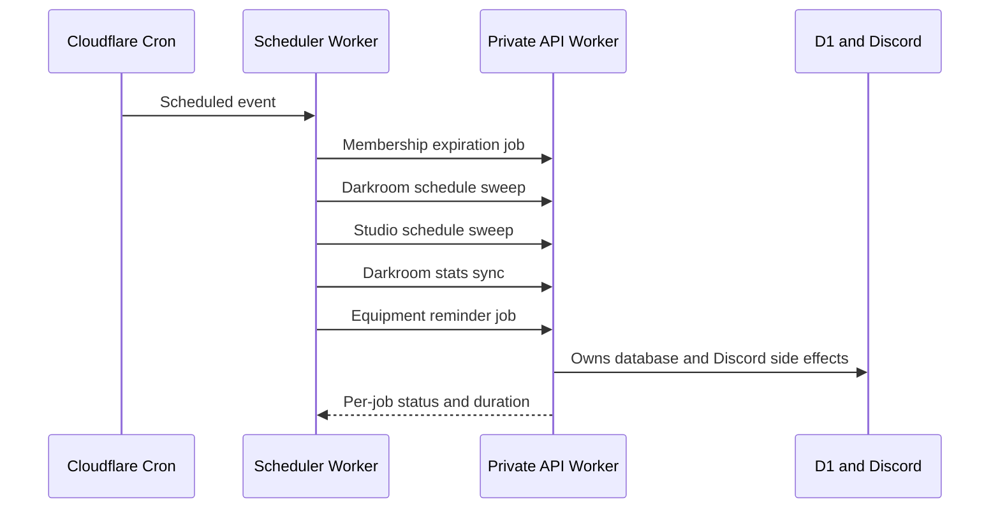

# Purdue Photo Scheduler Worker

<div align="center">

Cloudflare cron Worker that triggers Purdue Photography Club maintenance jobs through the private API Worker.

[](https://github.com/PurduePhotographyClub/purdue-photo-scheduler-worker/actions/workflows/ci.yml)


</div>

## What It Does

The Scheduler Worker owns time. The API Worker owns job logic and data changes. On each cron event, this Worker calls the API's internal job endpoints through a Cloudflare service binding and records a structured summary of the run.

## Flow



## Jobs

| Job | Owner | Purpose |
| --- | --- | --- |
| Membership expiration | API Worker | Expire stale memberships and keep dashboard state accurate |
| Darkroom schedule sweep | API Worker | Keep darkroom schedule records and Discord messages current |
| Studio schedule sweep | API Worker | Keep studio bookings and notifications current |
| Darkroom stats sync | API Worker | Refresh Discord-facing darkroom stats |
| Equipment reminders | API Worker | Send loan/reminder notifications through the platform |

## Tech Stack

| Layer | Technology |
| --- | --- |
| Runtime | Cloudflare Workers scheduled handler |
| Trigger | Cloudflare cron trigger |
| API boundary | Cloudflare service binding |
| Rate limiting | Cloudflare Rate Limiting binding for public health checks |
| Language | TypeScript |

## Development

```sh
npm install
npm run dev
```

Runtime secrets and deployment-specific settings are managed outside this public repository.

## Verification

```sh
npm run typecheck
npm run build
npm run doctor
npm run verify
```

`npm run build` performs a Wrangler dry-run deploy, which validates the Worker bundle without publishing it.

## Project Map

```text
src/index.ts                 Cron handler, health route, API job caller, and run summary types
worker-configuration.d.ts    Generated Cloudflare binding types
wrangler.toml                Worker metadata, cron timing, and non-secret bindings
```

## Operating Model

- Keep the Worker small: no direct database access and no Discord side effects.
- Add new scheduled behavior by adding an API-owned job endpoint first, then adding the path to `SCHEDULED_JOB_ENDPOINTS`.
- Health responses intentionally expose only service status and job count.
- Failed jobs are logged individually; the run summary keeps successful jobs visible even when one job fails.

## Assets And Licensing

This repo does not bundle image assets.
